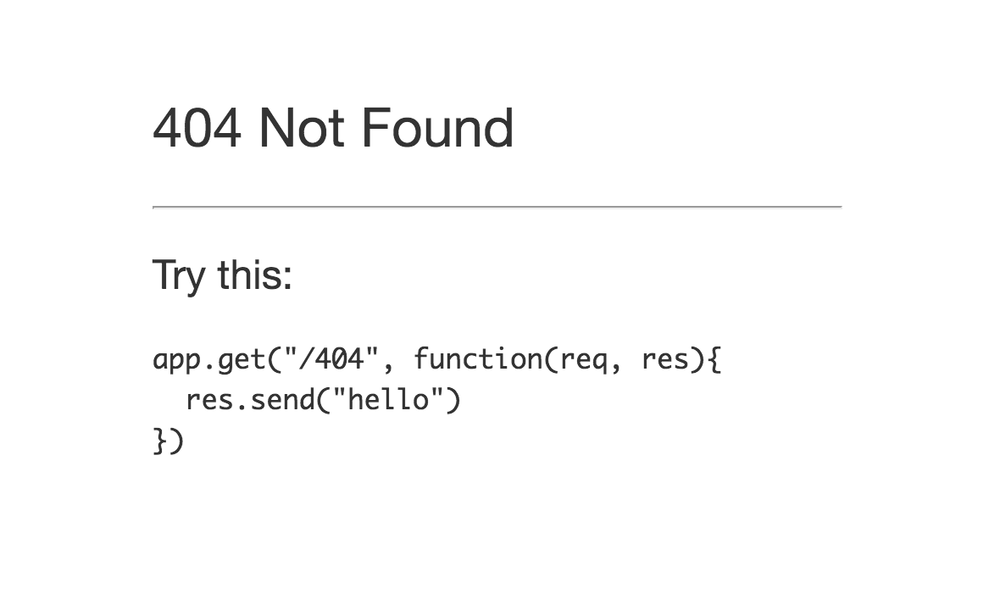
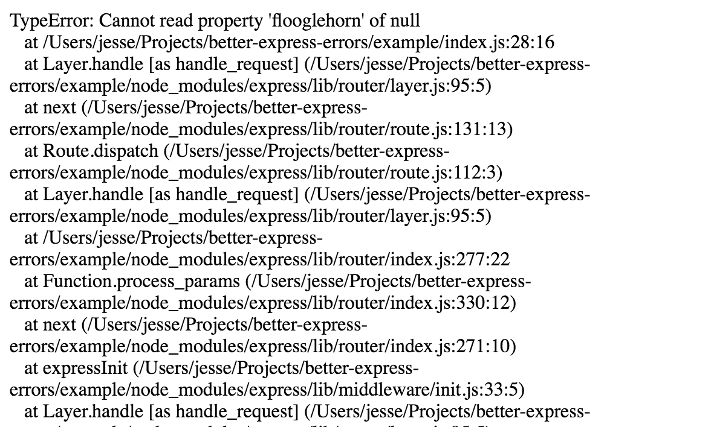
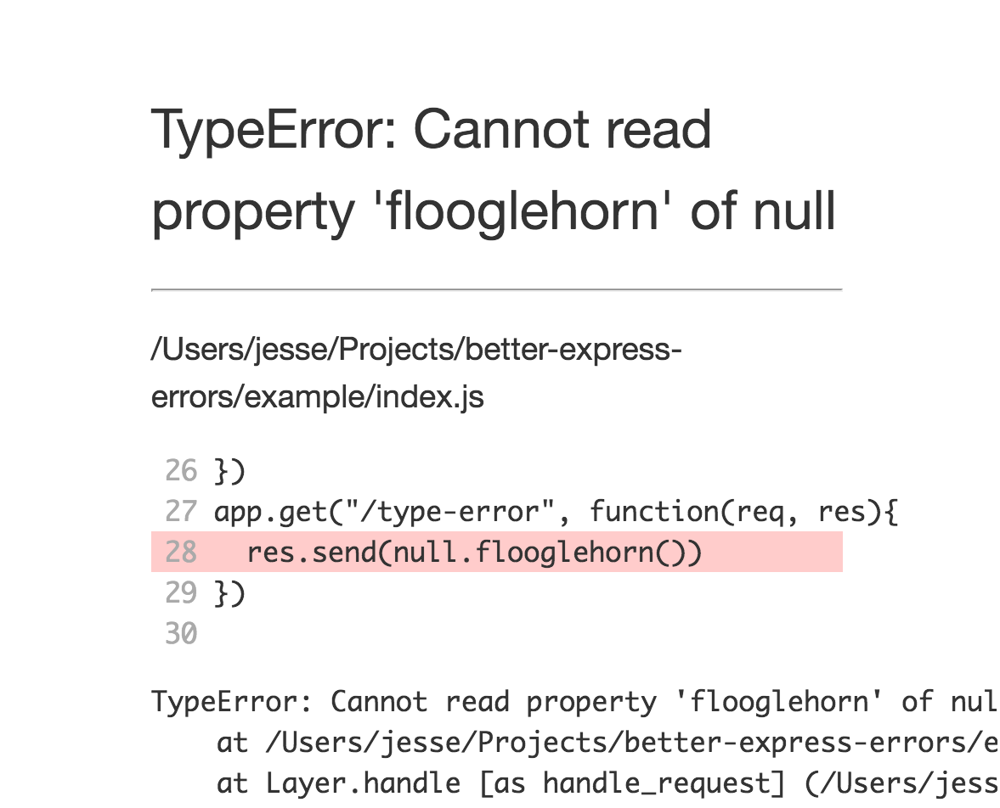
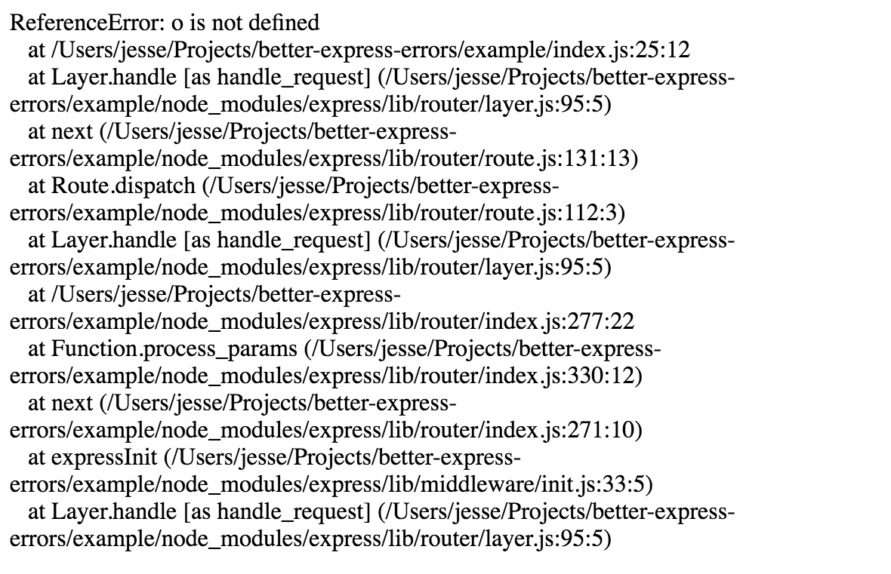
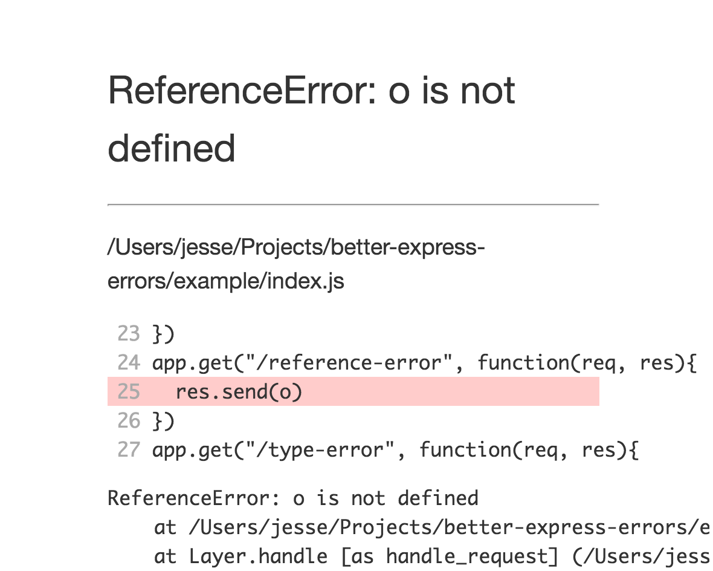
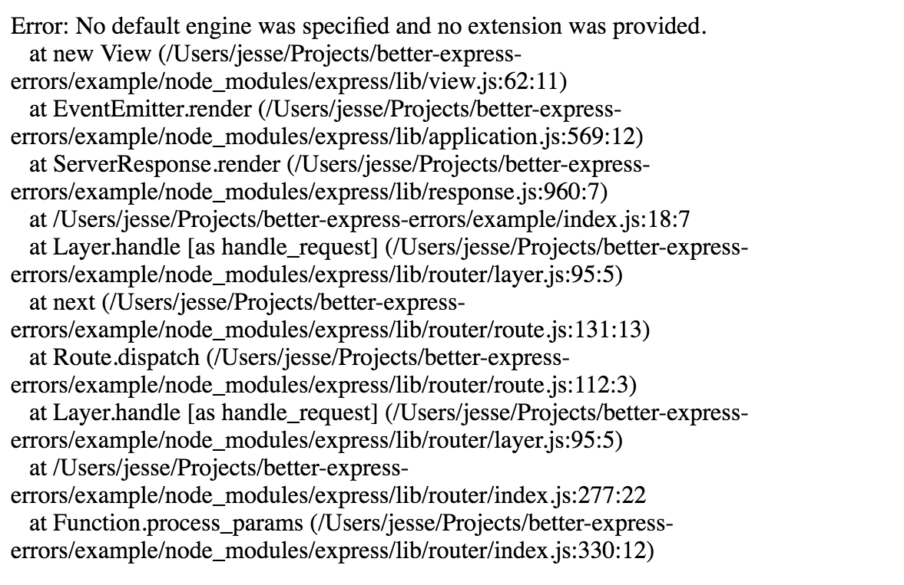
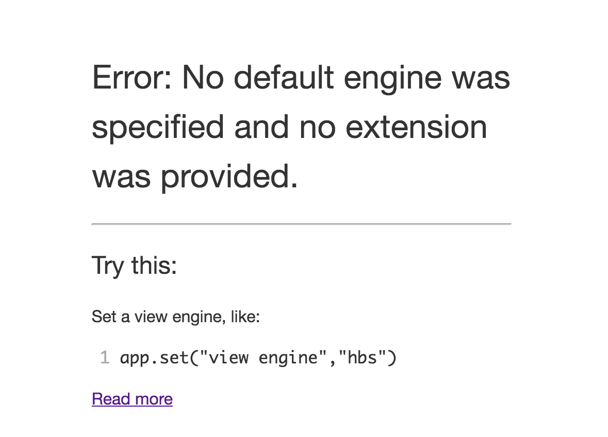
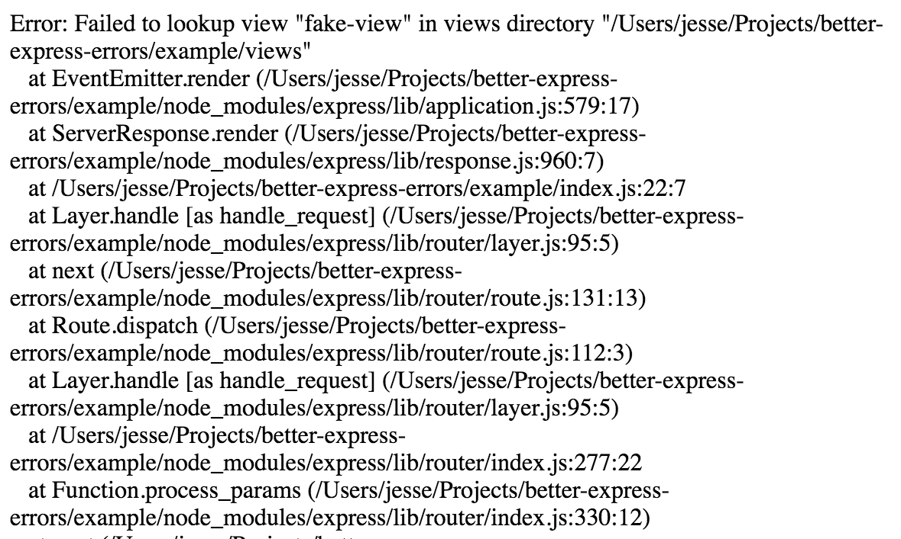
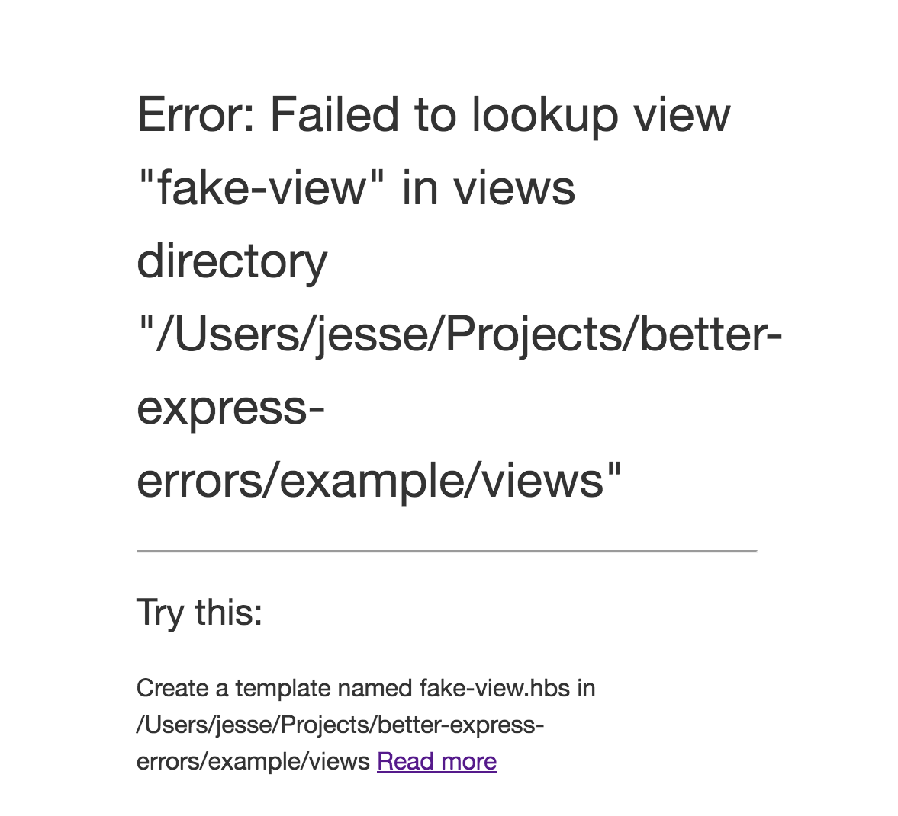

# Better Express Errors

## Installation


    npm install --save better-express-errors


```js
// after all other middleware and routes
app.use(require("better-express-errors")(app))
```

## What is it good for?

|Before|After|
| --- | --- |
||  |
||  |
||  |
||  |
||  |
